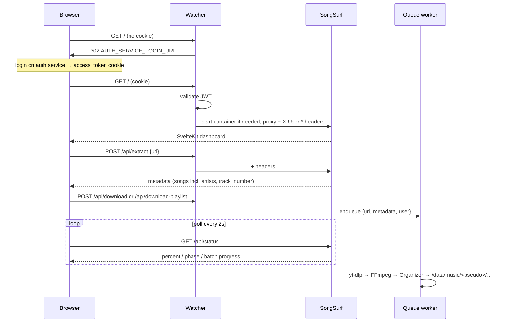
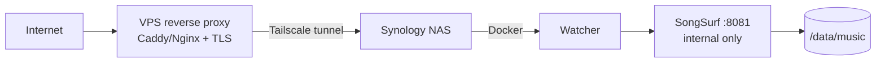

# Architecture — SongSurf

## System overview

SongSurf is a two-tier application: a lightweight authentication proxy (**Watcher**) sits permanently in front of the download engine (**SongSurf**), which is started and stopped on demand. All public traffic enters through Watcher (`WATCHER_PORT`, default 8080; production NAS uses 9000).

```mermaid
graph TD
    User((Browser)) -->|JWT cookie| W[Watcher :8080]
    Ext[Browser extension] -->|JWT cookie + CORS| W
    W -->|X-Watcher-Token + X-User-* headers| SS[SongSurf :8081]
    W -->|Docker SDK| D[Docker Engine]
    D -->|start / stop| SS
    SS --> YD[yt-dlp]
    YD --> FF[FFmpeg]
    FF --> ORG[Organizer]
    ORG --> MUSIC[/data/music/&lt;pseudo&gt;/<br/>Artist/Album/Title.mp3]
```

---

## Component breakdown

### Watcher (`watcher/watcher.py`)

Always running (~15 MB RAM). Responsibilities:

- **JWT validation** — reads the `access_token` HttpOnly cookie, validates HS256 locally with `AUTH_JWT_SECRET` (claims: `sub`, `role`, `email`, `token_type=access`, `exp`). No cookie/invalid → redirect to `AUTH_SERVICE_LOGIN_URL` (or 503 if unset). `DEV_MODE=true` bypasses with a local admin user.
- **Header injection** — every proxied request carries `X-Watcher-Token: <WATCHER_SECRET>` plus `X-User-Id` / `X-User-Role` (lowercased) / `X-User-Email` from the claims.
- **Container lifecycle** — starts the `songsurf` container on first authenticated request (Docker SDK via mounted `docker.sock`), serves a loading page while polling `/ping`.
- **Inactivity monitor** — warns after `INACTIVITY_WARN_TIMEOUT` idle seconds, stops the container after `+ INACTIVITY_GRACE_TIMEOUT`. `/watcher/keepalive` resets the timer; `/api/status` polling is passive (does not reset it).
- **CORS** — allows the browser extension origin to call the API.

### SongSurf (`server/app.py`)

Started on demand. Responsibilities:

- **Auth guard** — `WATCHER_SECRET` set → require matching `X-Watcher-Token` header (constant-time compare), then trust the `X-User-*` headers; `DEV_MODE` → injected dev user; otherwise locked.
- **Per-user storage** — `/data/music/<pseudo>/` where `pseudo` is derived from the email local part; admin role always maps to `ADMIN_PSEUDO`. `DEV_MODE` uses a flat `/data/music/`.
- **Download orchestration** — single `queue.Queue` (max 50), one worker thread, optional daily quota (`DAILY_DOWNLOAD_LIMIT`), batch progress for albums.
- **ZIP export** — members can export and download their library as ZIP; the member library is deleted after the download completes (temporary-library model). The admin library is never deleted.
- **Metadata editor API** — read/write any ID3 frame of a library file, upload covers.
- **Extension endpoints** — `/api/queue-direct` (held in a pending list consumed by the frontend), `/api/preview`, `/api/cookies/update`.

### Downloader (`server/downloader.py`)

Wraps yt-dlp:

- `extract_metadata(url)` — single video: title, artist (primary), **artists list**, album, album_artist, year, **track_number**, thumbnail candidates, duration. Rejects videos over `MAX_DURATION_SECONDS`.
- `extract_playlist_metadata(url)` — album/playlist via `extract_flat`: playlist title/artist/year/thumbnail + per-song `{title, artist, artists, url, id, duration, track_number}` (track number = `playlist_index` or position).
- `download(url, metadata)` — bestaudio → MP3 (FFmpeg, best VBR quality), staged in `/data/temp`, cached by filename for prefetch reuse.
- `prefetch_first_track` — used to show the real album cover during preview before the user confirms.
- Artist normalization: yt-dlp `artists` list preferred; string fallback split on `&`, `,`, `et`, `and`, `/`; ` - Topic` suffix stripped. The primary artist (first) names the folder.
- Cookies: if `/data/cookies.txt` exists (synced by the extension), yt-dlp uses it.

### Organizer (`server/organizer.py`)

Post-download file management:

- Places files as `Artist/Album/Title.mp3` (primary artist folder), duplicate-safe with `(n)` suffixes. MP3 only.
- Featuring detection — `feat./ft./featuring` parsed out of the title, re-appended as `(feat. X)`, and featured artists added to the TPE1 list.
- ID3 tags (Mutagen): `TIT2`, `TPE1` **multi-value**, `TPE2` album artist (always set, single value — Jellyfin grouping key), `TALB`, `TDRC`, `TRCK` as `n/total`, `APIC` embedded cover.
- `cover.jpg` written into each album folder (thumbnail sidecar → embedded APIC → FFmpeg frame extraction fallbacks); `extract_album_covers()` backfills the whole library.

---

## Request lifecycle



---

## Threading model

| Thread | Where | Purpose |
|---|---|---|
| Main Flask | SongSurf | HTTP handling, validation, enqueue |
| Download worker | SongSurf | Processes the queue one job at a time; updates `download_status` under `queue_lock` |
| Prefetch daemon | SongSurf | Pre-downloads the first playlist track for instant cover preview |
| Inactivity watcher | Watcher | Idle tracking → warn → stop container |

Shared state (`download_status`, `extension_pending`, daily counter, prefetch state) is lock-protected. Note: `cancel_flag` is checked by the worker but no route currently sets it (cancellation not wired).

---

## Deployment topology



Compose overlays merged at runtime by `docker/compose-switch.sh` from `DEPLOY_TARGET`:

| File | Role |
|---|---|
| `docker-compose.yml` | Base — services, volumes, healthchecks |
| `docker-compose.local.yml` | Dev — publishes ports to localhost (bridge) |
| `docker-compose.nas.yml` | Prod — `network_mode: host` |

---

## Frontend architecture

SvelteKit (adapter-static) — static bundle built in the Docker multi-stage build (Node → Python image) and served by Flask (`/` and `/_app/*`).

```
frontend/src/
  routes/
    +layout.svelte         theme init, session polling, nav
    +page.svelte           dashboard: URL analyzer, queue, library, progress
    metadata/+page.svelte  library browser + full ID3 editor (multi-value via «;»)
  lib/
    api.js                 fetch wrapper — all backend calls
    stores.js              user, theme, workerBusy, urlQueue, extensionQueue
    components/            DownloadPanel, UrlQueue, LibraryTree,
                           ProgressZone, Toast, WatcherInactivity
```

Key flows:

- **UrlQueue** processes one item at a time, waits for the worker (`workerBusy` store fed by `/api/status` polling) before sending the next; persists across navigation.
- **Extension intake**: the frontend polls `/api/extension-queue/consume` and feeds items into the same visual queue.
- Design tokens come from the MyCss design system (CSS custom properties, light/dark via `html.dark`).

---

## Stack summary

| Layer | Technology |
|---|---|
| Backend | Python 3.11 + Flask |
| Download | yt-dlp (+ optional cookies from the extension) |
| Audio | FFmpeg (MP3, best VBR) |
| Tags | Mutagen (ID3v2.4, multi-value frames) |
| Images | Pillow (cover crop/resize → JPEG) |
| Frontend | SvelteKit, adapter-static |
| Containers | Docker Compose overlays + Docker SDK (lifecycle) |
| Auth | HS256 JWT (rev0auth) validated by Watcher |
