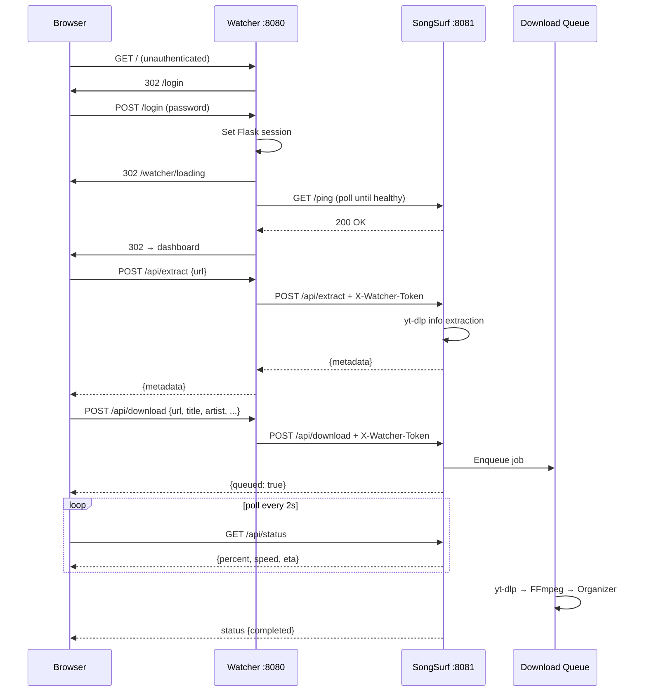
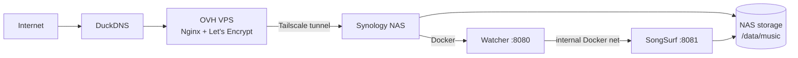

# Architecture — SongSurf

## System Overview

SongSurf is a two-tier application: a lightweight authentication proxy (**Watcher**) sits permanently in front of the download engine (**SongSurf**), which is started and stopped on demand. All public traffic enters through Watcher on port 8080.

```mermaid
graph TD
    User((Browser)) -->|:8080| W[Watcher]
    W -->|auth pass + WATCHER_SECRET header| SS[SongSurf :8081]
    W -->|Docker SDK| D[Docker Engine]
    D -->|start/stop| SS
    SS --> YD[yt-dlp]
    YD --> FF[FFmpeg]
    FF --> ORG[Organizer]
    ORG --> MUSIC[/data/music<br/>Artist/Album/Title.mp3]
    ORG --> GUEST[/data/music_guest/<br/>&lt;session_id&gt;/]
```

---

## Component Breakdown

### Watcher (`watcher/watcher.py`)

Always running (~15 MB RAM). Responsibilities:

- **Authentication** — form-based login for admin and guest roles; brute-force protection (5 attempts → 15-minute IP lockout)
- **Loading screen** — polls SongSurf health (`/ping`) during startup and serves a "loading" page until it's ready
- **Reverse proxy** — injects `X-Watcher-Token: <WATCHER_SECRET>` on all forwarded requests
- **Inactivity monitor** — tracks last request timestamp; warns admin after `INACTIVITY_TIMEOUT` seconds, force-stops SongSurf container after an additional `INACTIVITY_GRACE_TIMEOUT` seconds with no response

### SongSurf (`SongSurf/server/app.py`)

Started on demand by Watcher. Responsibilities:

- **Auth guard** — in Watcher mode, validates `X-Watcher-Token` header; in standalone mode, falls back to password-based session auth
- **Download orchestration** — single `threading.Queue`; one download active at a time, up to 50 queued
- **Guest session lifecycle** — per-session TTL, quota enforcement, deferred cleanup, ZIP export
- **API surface** — REST JSON API consumed by vanilla-JS frontend

### Downloader (`SongSurf/server/downloader.py`)

Wraps yt-dlp. Responsibilities:

- URL extraction and metadata parsing (title, artist, album, year, thumbnail, duration)
- Single-song and playlist download to `TEMP_DIR`
- FFmpeg MP3 conversion (auto-detects ffmpeg binary path)
- Real-time progress callbacks (`DownloadProgress` class) polled by `/api/status`
- Duration guard: rejects videos exceeding `MAX_DURATION_SECONDS` (default 9000s = 2h30)

### Organizer (`SongSurf/server/organizer.py`)

Post-download file management. Responsibilities:

- ID3 tag writing via Mutagen (title, artist, album, year, track number)
- "Featuring" detection — parses `feat.` / `ft.` from title and moves artist credit to proper tag
- File organization: `Artist/Album/Title.mp3` under target music directory
- Album art extraction from yt-dlp thumbnail, stored as JPEG sidecar

---

## Request Lifecycle



---

## Threading Model (SongSurf)

| Thread | Purpose | Notes |
|---|---|---|
| Main Flask thread | HTTP request handling, validation, queue push | Synchronous per-request |
| Download worker | Processes `queue.Queue` one job at a time | Daemon; cancel via `cancel_flag` event |
| Guest cleanup | Periodic TTL check, auto-ZIP, deferred file deletion | Sleeps 30s between sweeps |
| Prefetch daemon | Pre-downloads first playlist track in background | Allows immediate preview cover art |

All shared state (`download_status`, `guest_sessions`) is protected by `threading.Lock`.

---

## Authentication Modes

```
Production (Watcher mode)            Standalone (dev / fallback)
─────────────────────────────        ─────────────────────────────
Watcher validates password           SongSurf validates password
Sets Flask session cookie            Sets Flask session cookie
Injects X-Watcher-Token              No token — session cookie only
SongSurf checks token only           SongSurf checks session cookie
```

When `WATCHER_SECRET` is set in SongSurf's environment, all auth decisions defer to Watcher. Without it, SongSurf falls back to its own `SONGSURF_PASSWORD`.

---

## Planned Auth Migration

```
Current (v1.0)                       Future (v2.0)
──────────────────────────           ──────────────────────────────
Watcher form login                   External Auth Docker → JWT
Watcher injects X-Watcher-Token      Watcher validates JWT
SongSurf checks token                SongSurf checks token (same)
/login, /logout in both              Removed from both
```

SongSurf's per-session folders will be preserved per-user when multi-account support lands.

---

## Deployment Topology



Two Docker Compose overlay files are merged at runtime:

| File | Role |
|---|---|
| `docker-compose.yml` | Base — service definitions, volumes, healthchecks |
| `docker-compose.local.yml` | Dev — publishes ports 8080 and 8081 to localhost |
| `docker-compose.nas.yml` | Prod — sets `network_mode: host` for direct NAS networking |

`./docker/compose-switch.sh` selects the overlay based on `DEPLOY_TARGET`.

---

## Frontend Architecture

No framework or bundler. Pure HTML + Jinja2 + vanilla JS.

```
static/css/
  design-system.css     CSS custom properties (colors, spacing, radii, typography)
  components.css        Atomic UI components (btn, card, form, modal, alert, badge)
  layouts.css           Page grids and flex helpers
  pages/
    dashboard.css       Admin dashboard page-level styles
    guest.css           Guest dashboard page-level styles
    auth.css            Login page styles

static/js/
  api.js                Thin HTTP client wrapping all backend endpoints
  components/
    modal.js            Modal open/close lifecycle
    progress-bar.js     Progress visualization component
    toast.js            Notification system
    watcher-inactivity.js  Inactivity warning banner (shown by Watcher polling)
  pages/
    dashboard-admin.js  Admin dashboard (~2000 lines: extract, download, queue, library)
    guest-unified.js    Guest dashboard (extract, download, quota, ZIP, session timer)

templates/
  base.html             Jinja2 skeleton — CSS/JS blocks
  pages/
    dashboard_admin.html   Admin 70/30 grid layout
    guest_dashboard.html   Guest single-column layout
    loading.html           Watcher loading screen
    login.html             Auth form (admin + guest tabs)
```

### CSS Design Tokens

All visual values are defined once in `design-system.css`:

```css
--color-bg-primary: #0a0a0f
--color-primary:    #7c3aed
--gradient-brand:   linear-gradient(135deg, #ff3b6d, #7c3aed)
--space-4: 16px
--radius-xl: 12px
--font-size-base: 13px
```

Breakpoints: mobile `< 640px` · tablet `640–1024px` · desktop `> 1024px`

---

## Stack Summary

| Layer | Technology |
|---|---|
| Backend | Python 3.11 + Flask 3.0 |
| Download engine | yt-dlp (auto-updated at container start) |
| Audio conversion | FFmpeg |
| Tag writing | Mutagen 1.47 |
| Image handling | Pillow |
| Containerization | Docker Compose |
| Frontend | HTML5 + Jinja2 + Vanilla JS + CSS3 |
| Proxy control | Docker SDK for Python (Watcher controls SongSurf container) |
